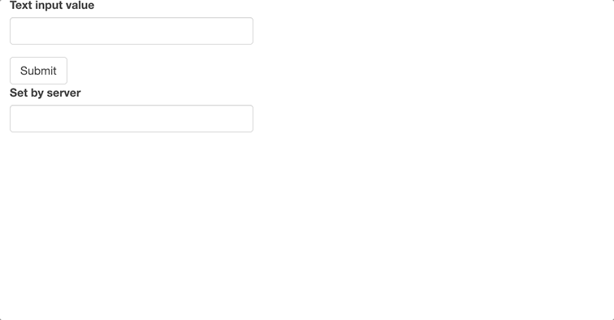
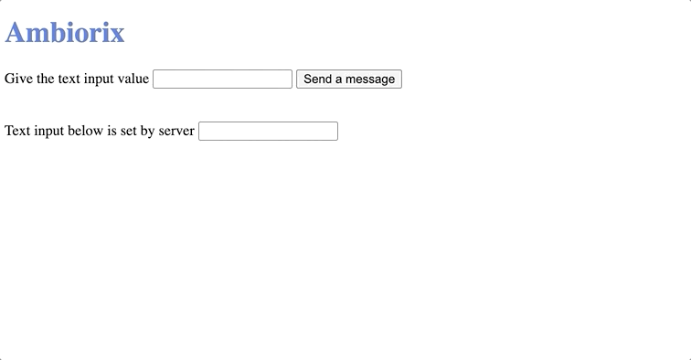

# Shiny Input

The idea in this example is not to just reproduce the functionalities of a shiny application with ambiorix but also to do so using the same technology: websockets, even though one may not want to go about it this way in ambiorix.

<!-- panels:start -->
<!-- div:title-panel -->

## Shiny

<!-- div:left-panel -->

```r
library(shiny)

ui <- fluidPage(
  textInput("inp", "Text input value"),
  actionButton("submit", "Submit"),
  textInput("out", "Set by server")
)

server <- function(input, output, session){
  observeEvent(input$submit, {
    updateTextInput(session, "out", value = input$inp)
  })
}

shinyApp(ui, server)
```

<!-- div:right-panel -->

Here we build a shiny application that takes a text input, upon clicking a button sends that value to the server which uses it to update another text input.



<!-- panels:end -->

## Ambiorix

The easiest way to setup the structure for this application (with websocket support) is to use the [CLI](https://github.com/JohnCoene/ambiorix-cli) or `ambiorix.generator::create_basic()` from the [ambiorix.generator](https://github.com/JohnCoene/ambiorix.generator) package.

The server only responds to one request to the homepage (`/`) to which it sends an HTML file we shall cover next. The server also listens to websocket messages named `textValue` which it sends back as another message with a different name: `setTextValue`.

```r
library(ambiorix)

app <- Ambiorix$new()

# serve static files
app$static("assets", "static")

# homepage
app$get("/", \(req, res){
  res$send_file("home")
})

# websocket 
app$receive("textValue", \(msg, ws){
  ws$send("setTextValue", msg)
})

app$start()
```

In the HTML we use ambiorix' websocket library to listen to messages named `setTextValue` sent from the server and use it to set the input value of text input `name2`.

We also have a `sendValue()` function on a submit button to collect the value of the first input and send it to ambiorix' server.

```html
<!DOCTYPE html>
<html lang="en">
<head>
  <meta charset="UTF-8">
  <meta name="viewport" content="width=device-width, initial-scale=1.0">
  <link rel="stylesheet" href="static/style.css">
  <script src="static/ambiorix.js"></script>
  <script>
    var wss = new Ambiorix();
    wss.receive("setTextValue", function(msg){
      document.getElementById('name2').value = msg;
    });
    wss.start();
  </script>
  <title>Ambiorix</title>
</head>
<body>
  <h1 class="brand">Ambiorix</h1>
  <label for="name">Give the text input value</label>
  <input type="text" id="name" name="name">
  <button onclick="sendValue();">Send a message</button>
  <br>
  <br>
  <br>
  <label for="name">Text input below is set by server</label>
  <input type="text" id="name2" name="name2">
  <script>
    sendValue = function(){
      let val = document.getElementById('name').value;
      Ambiorix.send('textValue', val)
    }
  </script>
</body>
</html>
```


