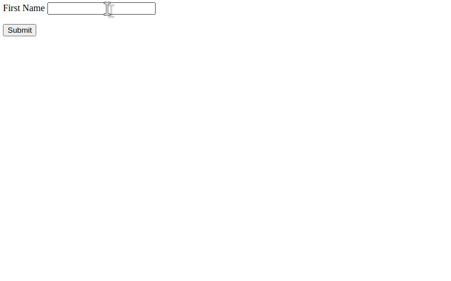

# POST

This creates an application that provides a form to where there user can enter their first name, upon clicking the submit button the data is multipart encoded and submitted to `/submit`. Hence the `post` method which parses the body and returns a response containing said name. 

```r
# app.R
library(ambiorix)
library(htmltools)

app <- Ambiorix$new()

app$get("/", \(req, res){

  # form
  # sends to /submit
  form <- tagList(
    tags$form(
      action = "/submit", enctype = "multipart/form-data", method = "POST",
      p(
        tags$label(`for` = "first_name", "First Name"),
        tags$input(type = "text", name = "first_name")
      ),
      tags$input(type = "submit")
    )
  )

  res$send(form)
})

app$post("/submit", \(req, res){
  body <- parse_multipart(req)
  res$send(h1("Your name is", body$first_name))
})

app$start()
```


