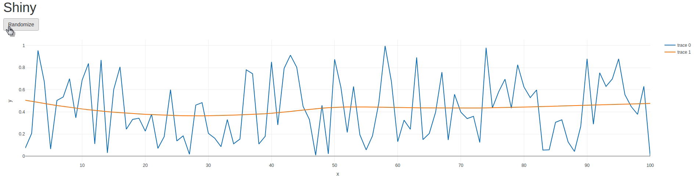
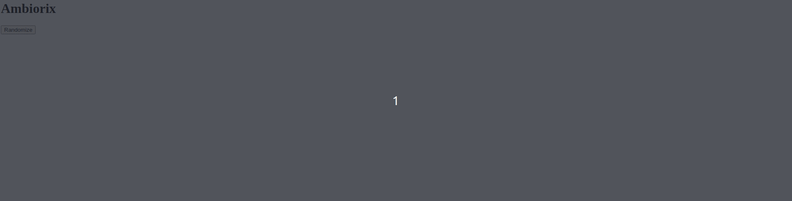

# Recreating a shiny app

Here we demonstrate how to reproduce a basic shiny application with ambiorix: a simple app which at the click of a button fits a polynomial to randomly generated data, this is visualised with [plotly](https://plotly-r.com/).

<!-- panels:start -->
<!-- div:title-panel -->

## Shiny

<!-- div:left-panel -->

```r
library(shiny)
library(plotly)

ui <- fluidPage(
  h1("Shiny"),
  actionButton("randomize", "Randomize"),
  plotlyOutput("chart")
)

server <- function(input, output){
  output$chart <- renderPlotly({
    input$randomize

    df <- list(
      x = 1:100,
      y = runif(100)
    )

    model <- loess(y ~ x, data = df)
    augmented <- broom::augment(model)

    augmented %>% 
      plot_ly(x = ~x, y = ~y, type = 'scatter', mode = 'lines') %>% 
      add_lines(y = ~.fitted)
  })
}

shinyApp(ui, server)
```

<!-- div:right-panel -->

The ui consists of a button and the `plotlyOutput`.

In the server we place `input$randomize` in the `renderPlotly` function so it retriggers that expression.



<!-- panels:end -->

## Ambiorix

One could reproduce this with ambiorix in numerous ways. It could be done à la shiny: using the websocket to send a message to the server when the plot is clicked and have the server respond with the chart configuration but we shall go a different way.

We can build an endpoint that returns the randomize `loess` and, in JavaScript bind the button to a function that fetches this endpoint and produces the chart.

The back can be fairly simple the homepage (`/`) sends an HTML file (which we'll create right after this). We also create the endpoint that generates the random data, runs `loess` and sends a JSON response.

```r
# app.R
library(ambiorix)

app <- Ambiorix$new()

# homepage
app$get("/", \(req, res){
  res$send_file("home")
})

app$get("/randomize", \(req, res){

  df <- list(
    x = 1:100,
    y = runif(100)
  )

  model <- loess(y ~ x, data = df)
  augmented <- broom::augment(model)

  data <- list(
    x = augmented[["x"]],
    y = augmented[["y"]],
    fitted = augmented[[".fitted"]]
  )
  res$json(data)
})

app$start()
```

Then in HTML we import plotly from the CDN in the `head`, add a button which runs the JavaScript function `randomize()` that fetches the data from the `/randomize` endpoint and generates the chart.

```html
<!DOCTYPE html>
<html lang="en">
<head>
  <meta charset="UTF-8">
  <meta name="viewport" content="width=device-width, initial-scale=1.0">
  <script src="https://cdn.plot.ly/plotly-latest.min.js"></script>  
</head>
<body>
  <h1>Ambiorix</h1>
  <button onclick="randomize()">Normalize</button>
  <div id="chart"></div>
  <script>
    randomize = function(){
      fetch("/randomize")
        .then(response => response.json())
        .then(data => {
          var trace1 = {
            x: data.x,
            y: data.y,
            type: 'line'
          };

          var trace2 = {
            x: data.x,
            y: data.fitted,
            type: 'line'
          };

          var data = [trace1, trace2];

          Plotly.newPlot('chart', data);
        });
    }
  </script>
</body>
</html>
```


