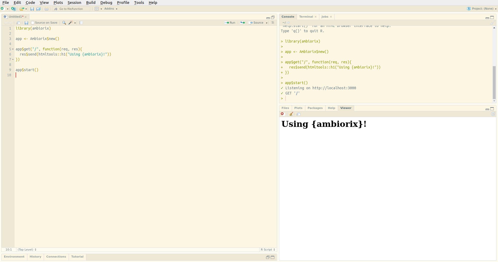

# Hello World

First, make sure you have the package installed. It is not yet available from CRAN but can be installed from Github with the [remotes](https://remotes.r-lib.org/) package.

```r
# install.packages("remotes")
remotes::install_github("JohnCoene/ambiorix")
```

By default ambiorix will serve the application on a random port, this can be changed, along with other things, when instantiating the class. 

```r
library(ambiorix)

app <- Ambiorix$new()

app$get("/", function(req, res){
  res$send("Using {ambiorix}!")
})

app$start()
```



