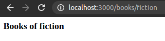
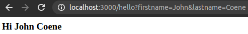

# Parameters & Query

Ambiorix allows using parameters in the URL and also parses the query string for convenience. 

- Parameters are accessible at `req$params$param_name`
- Query are accessible at `req$query$query_name` or `req$query[[index]]` if unnamed.

<!-- panels:start -->
<!-- div:title-panel -->

## Parameters

<!-- div:left-panel -->

Use `:<param>` to indicate a parameter which can then be accessed with `req$params$<name>`.

``` r
library(ambiorix)

app <- Ambiorix$new()

app$get("/books/:category", \(req, res){
  res$send(htmltools::h3("Books of", req$params$category))
})

app$start()
```

<!-- div:right-panel -->

Visiting `/books/fiction` produces:



<!-- panels:end -->


<!-- panels:start -->
<!-- div:title-panel -->

## Query

<!-- div:left-panel -->

The parsed query string can also be accessed from the `req` object. Note that you may include named URL query arguments in the `path` for clarity __these are not taken into account when matching path to requests.__

``` r
library(ambiorix)

app <- Ambiorix$new()

app$get("/hello?firstname&lastname", \(req, res){
  res$send(htmltools::h3("Hi", req$query$firstname, req$query$lastname))
})

app$start()
```

<!-- div:right-panel -->

Visiting `/hello?firstname=John&lastname=Coene` produces:



<!-- panels:end -->

