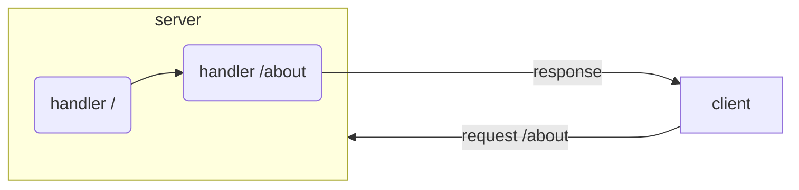

# Routing

When a client (web browser) points to a path (e.g.: `/about`) a request is made to the server (`GET` in this case), ambiorix then looks through the handlers __in the order they were added__ and when it finds one that matches the requested path runs the handler function (`\(req, res)`). This function should return a response (using the `res` object) or a future (see [asynchronous programming](/guide/async)).

```r
library(ambiorix)

app <- Ambiorix$new()

app$get("/", \(req, res){
  res$text("Home!")
})

app$get("/about", \(req, res){
  res$send("About me!")
})

app$start()
```

In the app above when the client (browser) points to `/about` the server goes over the handlers in the order they are specified looking for a match, the first `/` does not match, the second `/about` does; it therefore runs the `handler` which sends a response back.



## Handler

The handler function used for every route __must take 2 arguments__: the request, and the response. The first holds data on the request that is made to the server, which contains many things but importantly includes `parameters` and the parsed `query` string. You can learn more about these in the [parameters and query ](/guide/params) section.

```r
library(ambiorix)

app <- Ambiorix$new()

app$get("/?name", \(req, res){
  msg <- htmltools::h1("Hello", req$query$name)
  res$send(msg)
})

app$get("/users/:id", \(req, res){
  msg <- sprintf("This is user id: #%s", req$params$id)
  res$text(msg)
})

app$start()
```

## Forward

Since routes are checked in a certain order one can use `forward` to indicate that the next route should be checked instead.

```r
library(ambiorix)

app <- Ambiorix$new()

app$get("/next", \(req, res){
  forward()
})

app$get("/next", \(req, res){
  res$send("Hello")
})

app$start()
```

If no route match the requested path then ambiorix runs the `404`/`not_found` handler, see [not found](guide/not-found). 

Routing is crucial to ambiorix, it therefore also comes with a [router](guide/router) to better structure complex routing for large applications.
